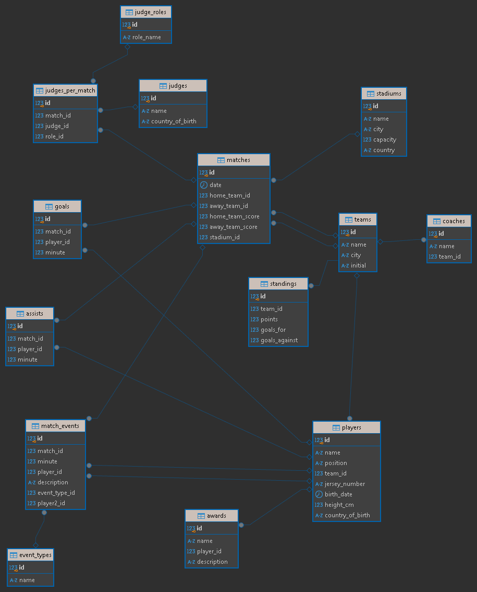

## Proyecto Backend

El obketivo principal de este proyecto es desarrollar una aplicación de gestión tomando como ejemplo una liga de futbol, que permita administrar equipos, jugadores, partidos, estadísticas y otras funcionalidades relacionadas, asegurando un rendimiento óptimo, escalabilidad y seguridad.

 

### Lenguaje:

### Framework

### Database

### Otro

## ¿Que contiene el Proyecto?
1. Capa de Repositorio (Interfaces que realizan consultas en Bases de Datos). 
2. Capa de Servicio (Interface y Clase que se encargan de la lógica de negocio, utiliza inyección de 
dependencias de la capa de Repositorio). 
3. Capa de Controladores (Clases Java que exponen los Endpoints para consumir servicios REST tipo 
POST, PUT, GET, DELETE) 
4. Pruebas unitarias Capas Repositorio. 

## Diagrama ER
 